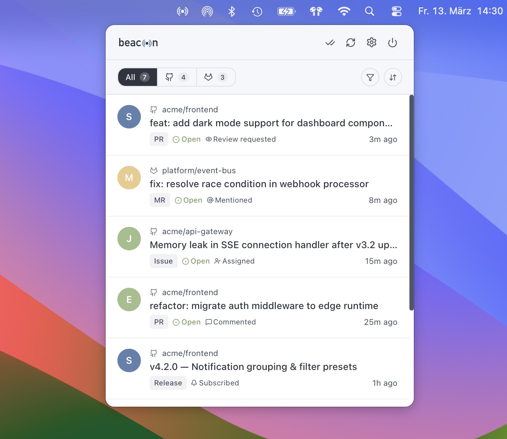

<p align="center">
  
</p>

<p align="center">
  A lightweight macOS menu bar app that brings GitHub and GitLab notifications into one place.<br>
  Learn more at <a href="https://konradmichalik.github.io/beacon/">konradmichalik.github.io/beacon</a>
</p>

<p align="center">
  
</p>

---

## ✨ Features

- **Unified inbox** for GitHub and GitLab notifications side by side
- **My PRs overview** — see open pull requests you authored or need to review, with CI, review and merge status at a glance
- **Issues overview** _(opt-in)_ — open issues you created or are assigned to, grouped by role; enable it in Settings
- **Menu bar popup** — lives quietly in the tray, one click to open
- **Filter & sort** by source, project, type, or read status
- **Desktop notifications** — instant alerts or batched summaries
- **Configurable badge** — unread count or a colored dot indicator

## 🍺 Installation

<a href="https://github.com/konradmichalik/homebrew-tap"></a>
<a href="https://github.com/konradmichalik/homebrew-tap"></a>

```bash
brew install konradmichalik/tap/beacon
```

> [!NOTE]
> Homebrew 6.0+ requires explicit trust for non-official taps. Installing the fully qualified formula above automatically trusts just `beacon` — no extra step needed. To trust the whole tap instead (e.g. for future short-name installs), run `brew tap konradmichalik/tap && brew trust konradmichalik/tap` first.

### Update

```bash
brew update && brew upgrade beacon
```

## ⚙️ Configuration

On first launch, open **Settings** via the gear icon or the tray context menu and add your tokens.

| Service | Token                                                                              | Required scope  |
| ------- | ---------------------------------------------------------------------------------- | --------------- |
| GitHub  | [Personal Access Token](https://github.com/settings/tokens/new)                    | `notifications` |
| GitLab  | [Personal Access Token](https://gitlab.com/-/user_settings/personal_access_tokens) | `api`           |

> [!TIP]
> GitLab supports self-hosted instances — set your instance's base URL in the GitLab settings panel.

> [!NOTE]
> Tokens are stored locally on your Mac, in the app's private application-support directory. Nothing is sent to any server other than GitHub and GitLab.

## 💎 Credits

Notification sounds from [Pixabay](https://pixabay.com).

## 📜 License

[MIT](LICENSE)
