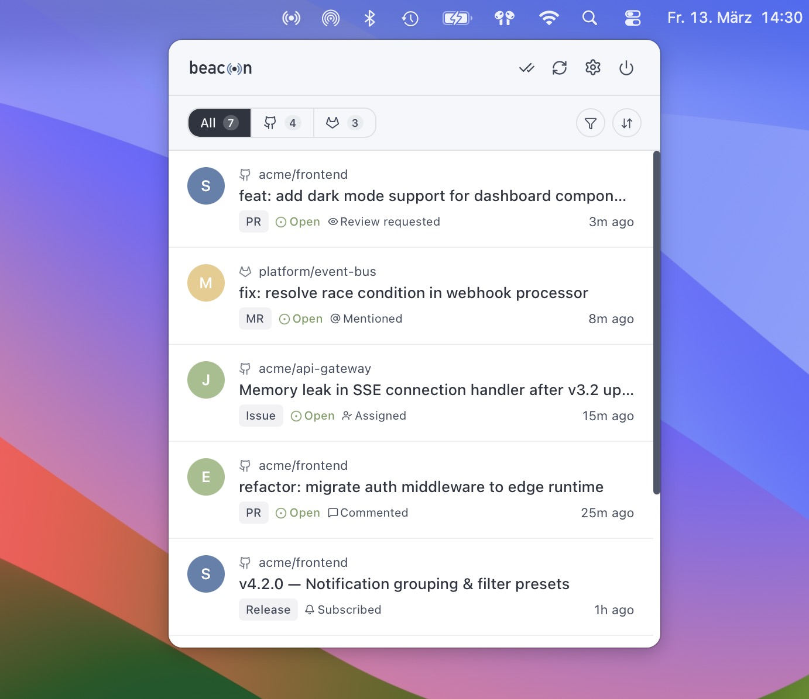

<p align="center">
  <br>
  
</p>

<p align="center">
  A lightweight macOS menu bar app that brings GitHub and GitLab notifications into one place.<br>
  Learn more at <a href="https://konradmichalik.github.io/beacon/">konradmichalik.github.io/beacon</a>
</p>

<p align="center">
  
</p>

---

## ✨ Features

- **Unified inbox** for GitHub and GitLab notifications side by side, including local alerts for pull request changes GitHub/GitLab never notify about (a draft becoming ready for your review, or your PR becoming mergeable)
- **My PRs overview** — see open pull requests you authored or need to review, with CI, review and merge status at a glance
- **Issues overview** _(opt-in)_ — open issues you created or are assigned to, grouped by role; enable it in Settings
- **Menu bar popup** — lives quietly in the tray, one click to open
- **Filter & sort** by source, project, type, or read status — or type qualifiers like `repo:owner/name`, `author:login`, `type:pr` (with a leading `-` to exclude)
- **Desktop notifications** — instant alerts or batched summaries
- **Configurable badge** — unread count or a colored dot indicator
- **Export for external tools** _(opt-in)_ — writes unread/review/PR/issue counts to `~/Library/Application Support/com.beacon.notifications/data.json` for external tools such as a Stream Deck plugin; disabling the setting removes the file

## 🍺 Installation

<a href="https://github.com/konradmichalik/homebrew-tap"></a>
<a href="https://github.com/konradmichalik/homebrew-tap"></a>

```bash
brew tap konradmichalik/tap
brew install beacon
```

### Update

```bash
brew update && brew upgrade beacon
```

## ⚙️ Configuration

On first launch, open **Settings** via the gear icon or the tray context menu and add your tokens.

| Service | Token                                                                              | Required scope  |
| ------- | ---------------------------------------------------------------------------------- | --------------- |
| GitHub  | [Personal Access Token](https://github.com/settings/tokens/new)                    | `notifications` |
| GitLab  | [Personal Access Token](https://gitlab.com/-/user_settings/personal_access_tokens) | `api`           |

> [!TIP]
> GitLab supports self-hosted instances — set your instance's base URL in the GitLab settings panel.

> [!NOTE]
> Tokens are stored in the macOS Keychain, not in a plain file. Nothing is sent to any server other than GitHub and GitLab.
> [!TIP]
> The first time Beacon reads or writes a token, macOS shows a one-time "Beacon wants to use your confidential information stored in Keychain" prompt. Choose **Always Allow**. A signed release build only asks again after a signing-identity change; an unsigned local dev build asks on every launch, since its signature changes with every build — see [`CLAUDE.md`](./CLAUDE.md) if that's you.

## 💎 Credits

Notification sounds from [Pixabay](https://pixabay.com).

## 📜 License

[MIT](LICENSE)
